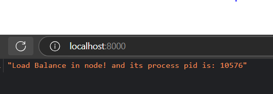
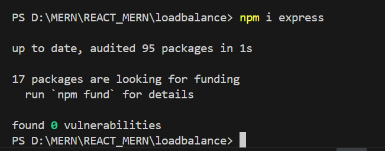
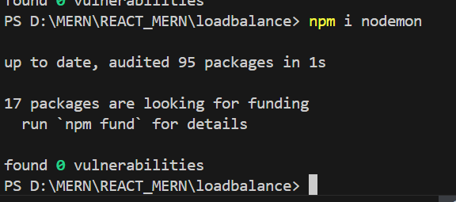
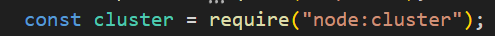
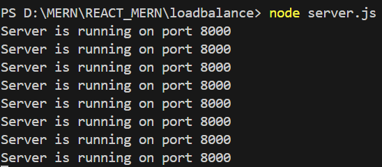

<h1 align ="center"LOAD BALANCING IN NODE</h1>
<!-- <h2><a href="https://mmjtechnologies-react-form.netlify.app/" target="_blank">Website Link</a></h2> -->

 <h3  align ="center"><b>Create load balance in node using Cluster and using Express Server</b></h3>
  

It is loadbalancer in Node created using Cluster and Express Server which is running on port 8000.

<!-- <ul>
 <li>Showing error</li> 
   
</ul> -->
 <h2>Atfirst run command ( npm init -y ) to create the ( package.json ) file on your code editor terminal or in cmd - by run this command</h2>
<h2>Then install express on your code editor terminal or in cmd - by run this command</h2>
<h2>npm install express</h2>
   
<h2>And then install nodemon on your code editor terminal or in cmd - by run this command</h2>
<h2>npm install nodemon</h2>
   
 <h2>And then import cluster in your code</h2>
<h2>const cluster = require("node:cluster");</h2>
   
 <h2>Atlast run the server on your code editor terminal or in cmd - by run this command</h2>
<h2>npm run dev</h2>
   
<ul>
<!--  <h2><b> Hooks </b></h2>
 <li>useForm</li> -->
 <h1><b>Programing Languages<b></h1>
<h2><b>Front-End</b></h2>
<li>HTML5</li>
<!--  <li>CSS3</li> -->
  <li>React js</li>
</ul>
<ul>
<h2><b> Back-End </b></h2>
 <li>Node js</li>
 <li>Express js</li>
</ul>

